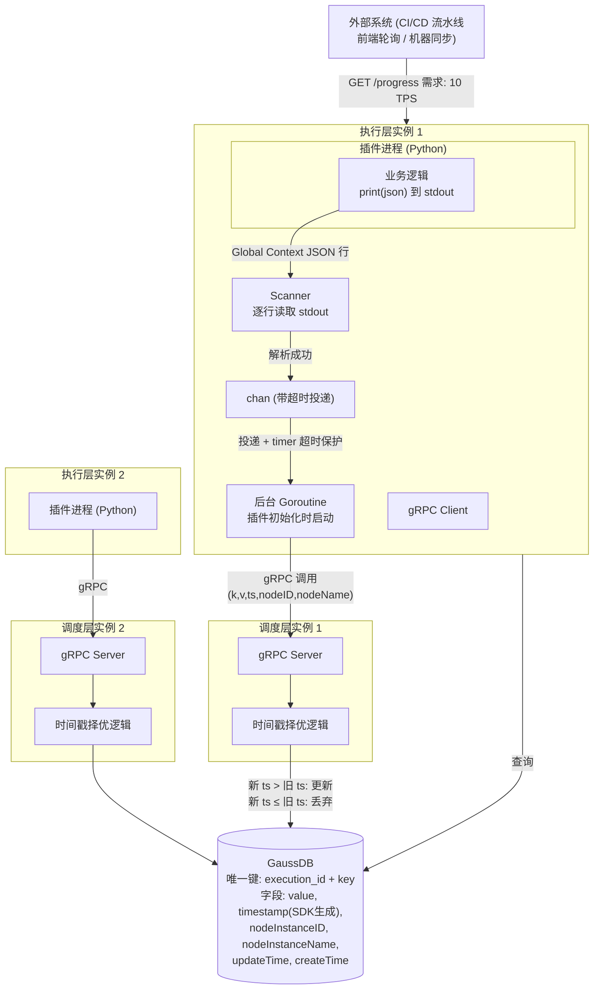

# 没有 Redis，分布式并发写入怎么搞？

> 一个 OaC 调度引擎的实战案例：时间戳择优 + SavePoint + 反压设计，以及为什么我们选择了 AP 而不是 CP。

---

## 1. 问题：多个插件同时上报进度，怎么写不冲突？

先交代背景。OaC（Operations as Code）调度引擎是一个编排执行系统，调度层解析用户编排模板，调用执行层的 Go 和 Python 插件来跑具体任务。最近做了一个叫 Global Context 的功能——插件执行过程中可以上报 KV 格式的进度数据，外部系统通过 API 实时查询"跑到第几步了"。

听起来不难。但几个约束条件摆上来，事情就不一样了：

- **分布式执行层**：执行层有两台以上机器，多个 Python 插件可能同时跑，同时写同一个 Key
- **无 Redis**：维护的组件没有 Redis 实例，分布式锁这条路不通
- **GaussDB 版本老**：我们的 GaussDB 版本不支持 `ON CONFLICT`（即 upsert 语法），数据库原子写入的捷径也没有

怎么在分布式多写者、无锁、无 upsert 的条件下，保证进度数据最终正确？

---

## 2. 数据流全貌

先看一下整体架构。下面是从 Python 插件到数据库的完整链路：



几个值得关注的点：

1. **Python 插件不是本地脚本**——调度层解析用户模板确定插件类型后，从内部平台动态拉取插件脚本，再由执行层通过 `shell python xx.py` 启动子进程执行。

2. **Go 和 Python 之间通过 stdout/stdin 通信**——Python 侧 `print(json)` 输出，Go 侧 Scanner 逐行解析。Global Context 数据夹杂在 stdout 流中，通过约定的 JSON 格式区分。

3. **chan + timer 反压是关键设计**——下面展开讲。

---

## 3. 为什么直觉方案在这里不行？

面对并发写入，三个最常见的方案逐一排除：

**方案 A：Redis 分布式锁。**
没 Redis。即使有，分布式锁引入的超时、死锁、Redis 不可用等问题，在一个"进度查询"场景下的收益也有限。

**方案 B：数据库行锁（`SELECT ... FOR UPDATE` 锁住所有同 execution 的行，串行化写入）。**
行得通，但全局串行化了所有插件的写入。插件写入频繁时，行锁变成瓶颈——本来是一个插件 5ms 的写入，排队等锁可能等到几百 ms。在不需要强一致的场景下，这个代价不值。

**方案 C：`ON CONFLICT` upsert。**
最简洁的解法——一条 SQL 搞定"存在则更新，不存在则插入"。但 GaussDB 版本太老，不支持。

**限制不是坏事。** 这三个方案被排除后，问题的边界变得清晰：我们要一个无锁、依赖普通 SQL、容忍短暂不一致的写入方案。在分布式系统里，边界清晰的受限问题比"什么都能用"的开放问题更好解。

---

## 4. 方案：时间戳择优 + SavePoint + 反压

### 4.1 时间戳设计：谁来打时间？

关键决策：时间戳由**插件 SDK 在调用 `write()` 时生成**，不是由数据库在入库时生成。

为什么？如果由 DB 打时间（`NOW()`），面对两个并发写入——先到达 DB 的被后到达的覆盖，但"先到达"不等于"先发生"。插件 A 比插件 B 早 1ms 调用 write，但如果 A 的网络抖动 100ms，B 的请求先到 DB——B 的写入会被 A 覆盖，而 B 才是"更晚发生"的那个。

SDK 打时间能更准确地表达"业务发生的先后"。配合 NTP 时钟同步（现网 agent 纳管，偏差在 ms 级别），时钟偏差远小于写入间隔。

数据库表设计也体现了时间语义的分层：

| 字段 | 来源 | 用途 |
|------|------|------|
| `timestamp` | 插件 SDK | 冲突裁决：新 ts 覆盖旧 ts |
| `updateTime` | SQL 中的值 | 审计：记录真实入库时间 |
| `createTime` | SQL 中的值 | 审计：记录首次创建时间 |
| `nodeInstanceID` / `nodeInstanceName` | 插件信息 | 记录谁最后更新 |

### 4.2 chan + timer：stdout 流不能被一个人堵死

在深入数据库之前，先看写链路上游的一个工程问题。

Python 插件通过 `print(json)` 向 stdout 写 Global Context 数据。Go 侧 Scanner 逐行解析 stdout，解析出进度数据后通过 `chan <-` 投递给后台 goroutine（插件初始化时启动），goroutine 通过 gRPC 调用调度层。

问题来了：如果一个 Global Context 的 gRPC 调用比较慢（网络抖动、DB 慢查询），`chan <-` 投递会阻塞，进而导致 Scanner 停止读取 stdout，进而导致 Python 侧 stdout 缓冲区满、`print()` 阻塞，最终**整个插件进程卡住**——而其他正常的 Global Context 数据也跟着被堵死了。

解决方案：**`chan <-` 配合 timer 设置 5s 超时。** 超时后丢弃本次投递并记录日志，继续下一条。保证 stdout 流的持续消费，不让单个慢调用堵死整条管线。

### 4.3 SavePoint 事务：INSERT 失败？那就 UPDATE

到了调度层，gRPC 收到数据（execution_id, key, value, timestamp, nodeInstanceID, nodeInstanceName），核心是在事务中完成"检查 → 插入或更新"。表结构有一个唯一键约束 `(execution_id, key)`，这是并发安全的基础。

事务流程：

```
BEGIN 事务
  SELECT WHERE execution_id=? AND key=?

  如果已存在:
    → 不检查 1000 Key 数量限制
    → UPDATE ... SET value=?, timestamp=?, ... WHERE timestamp < ?
       （新 ts > 旧 ts 才更新；新 ts <= 旧 ts 则 WHERE 不命中，0 rows affected，等价于丢弃）

  如果不存在:
    → SELECT COUNT WHERE execution_id=? → 检查是否 >= 1000
    → 若 >= 1000 → 拒绝写入
    → SAVEPOINT sp
    → INSERT (execution_id, key, value, timestamp, ...)
    → 若唯一键冲突（另一个调度层实例同时插入了同一 execution_id + key）:
        → ROLLBACK TO sp
        → 改为 UPDATE（回到"已存在"分支的 timestamp 比较逻辑）
COMMIT
```

几个关键设计点：

- **timestamp 比较在 SQL WHERE 条件内完成**（`WHERE timestamp < ?`），比较 + 更新是一次原子操作，没有 read-then-write 的竞态窗口。
- **SavePoint 捕获唯一键冲突后降级为 UPDATE**，避免了"插入失败 → 整个事务回滚 → 给业务方报错"的糟糕体验。这是"优雅降级"——并发冲突不是 error，只是一种需要处理的状态。
- **不依赖调度层的负载均衡策略**。无论 gRPC 请求被随机分配到哪个调度层实例，唯一键 + SavePoint 都能正确处理并发。

### 4.4 1000 Key 限制

业务方最初提了 5000 条/execution，经沟通降为 1000。既可防止单个 execution 的数据无限膨胀（本身也是一种 DOS 防护），也是一个可配置参数——修改主干配置、同版本部署即可生效，有默认值兜底。

---

## 5. 从 CAP 和 BASE 看这个设计

### 我们选择了 AP

| 维度 | 判定 | 依据 |
|------|------|------|
| **P (分区容错)** | 必须 | 执行层分布式，调度层多实例，DB 独立，任何环节都可能网络分区 |
| **A (可用性)** | 保证 | 写：无锁 + timer 反压 + SavePoint 兜底；读：直接查 DB，始终有响应 |
| **C (强一致性)** | 牺牲 | 两调度层实例可能同时读到旧数据并 UPDATE，短暂窗口内查询可能看到中间态 |

如果我们要强一致性（CP），需要在写入路径加锁（如 `SELECT ... FOR UPDATE` 锁住所有同 execution 的行），代价是所有插件串行写入。对于进度查询场景——用户关心的是"最终到哪一步"，不是"0.1 秒前到哪一步"——这个代价完全不划算。

### BASE 的体现

- **Basically Available（基本可用）**：chan 超时不丢数据（跳过当次，下一条继续）。SavePoint 冲突恢复不报错。写入永不阻塞。
- **Soft state（软状态）**：进度数据天生是软状态——同一时刻不同查询可能看到略有差异的进度。updateTime + createTime 为数据提供了完整的时间线追溯。
- **Eventually consistent（最终一致）**：只要没有持续写入同一 Key，所有查询最终收敛到最新 timestamp 的数据。收敛延迟 ≈ 最后一次 gRPC 调用 + DB 写入延迟（通常 < 100ms）。

---

## 6. 做对了什么、还没做什么

### GET 路径：做了一半，然后停了

最早的方案包含 GET——插件不仅能写，还能读其他插件的进度。设计路线是通过 stdout 发送读请求、stdin 返回结果。

但 GET 和 SET 是独立操作，并发场景下会出现经典的 read-modify-write 竞态：插件 A 读到旧值、计算新值、写入，但写入前插件 B 已经改了同一个 Key。Redis 通过 Lua 脚本将 GET+SET 打包为原子操作，但我们的 stdout/stdin 通信模型做不到。

领导评估改动量较大。和业务方进一步沟通时，追问"具体什么场景需要在插件侧读进度"，对方无法给出明确场景。最终双方达成一致：**暂停 GET 路径开发，待有明确场景再启动。**

这不是 scope-cutting，而是需求澄清——不做当前不需要的功能，才是好的工程决策。

### 还没做的事

- **压测**：自测发现单写约 5 QPS。在 2 个执行层实例 × 多个并发插件的生产场景下，瓶颈在哪里？是 gRPC 调用？是 DB 写入？是 chan 投递？没压过，不知道。
- **时钟偏差的边界情况**：两台机器 NTP 偏差 5ms，插件 A 在 T+1ms 写 Key=X，插件 B 在 T+3ms 写 Key=X，但 A 的网络延迟 10ms，B 的网络延迟 2ms——B 先入库，带着 B 的较新的 ts。等 A 到达时，因为 ts 较旧被丢弃。**B 赢了，结果是正确的。** 这个场景恰好说明"SDK 打时间 + NTP 同步"在大多数情况下工作良好。但如果时钟偏差 > 写入间隔，裁决就可能出错——不过进度查询场景可以容忍。
- **联调**：外部系统本月还没开始对接，目前只是自测通过。

---

## 7. 总结

这个方案不复杂——时间戳择优、SavePoint、chan timer 反压，每个单点都不算新技术。有意思的是它们组合起来的方式：**在给定的约束下（无 Redis、无 ON CONFLICT、stdout 通信），每个设计决策都是对约束的回应而非对"最佳实践"的照搬。**

分布式系统设计不是找完美的方案——是在"不能做什么"的边界里，找到"恰好够用"的那个。
